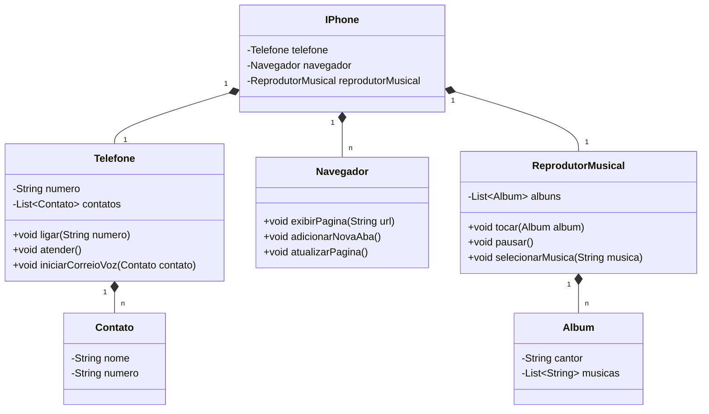

# Diagrama-Iphone-1
Projeto que simula as ferramentas de navegador , tocador de música e telefone.

```mermaid
classDiagram
class IPhone {
  -Telefone telefone
  -Navegador navegador
  -ReprodutorMusical reprodutorMusical
}

class Telefone {
  -String numero
  -List~Contato~ contatos
  +void ligar(String numero)
  +void atender()
  +void iniciarCorreioVoz(Contato contato)
}

class Contato {
  -String nome
  -String numero
}

class Navegador {
  +void exibirPagina(String url)
  +void adicionarNovaAba()
  +void atualizarPagina()
}

class ReprodutorMusical {
  -List~Album~ albuns
  +void tocar(Album album)
  +void pausar()
  +void selecionarMusica(String musica)
}

class Album {
  -String cantor
  -List~String~ musicas
}

IPhone"1" *-- "1" Telefone
IPhone "1" *-- "n" Navegador
IPhone "1" *-- "1" ReprodutorMusical
Telefone "1" *-- "n" Contato
ReprodutorMusical "1" *-- "n" Album
```
